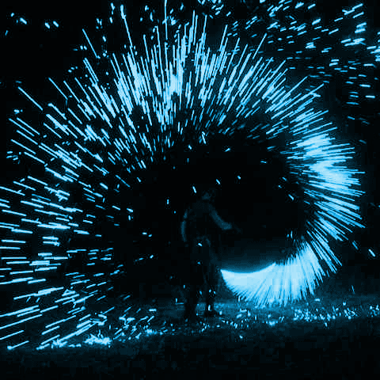
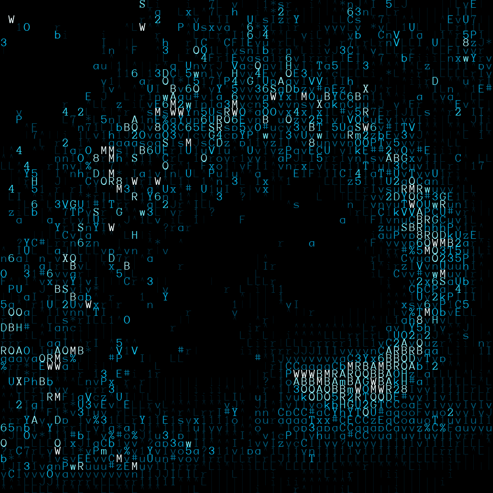

# Colortex
Colortex is a script, created to produce textually built images. 
Additional tweaking is available through filenames.

Before conversion, all images are downscaled using the scale factor, by default it's 6 
(width and height will be divided by 6). Be aware that on conversion stage each pixel of the 
source image will be replaced with 16x16px character. Improper selection of the scale factor 
consequently results in a huge output image. Usually, the best result is achieved on factor 
near 6, but the optimal value should be selected individually
for each image. Be aware that output images tend to be large. Long gif animation might take 
a few hundreds of megabytes.

<b>Folders:</b> 
*input* - Source files. Accepted types: bmp, png, jpg and gif. 
*output* - Converted files, saved as "png" or "gif". 
*used* - Processed files are to move into this folder. 

<b>Parameters:</b> 
"some file.png"" - no parameters 
"[3] some file.png" - downscale using factor 3 instead of default 6 
"[5-10] some file.png" - generate separate images for scale factors from 5 to 10 (inclusive)

Example of source image (animated gif, only first frame showed):

Example of output image (animated gif, only first frame showed):

